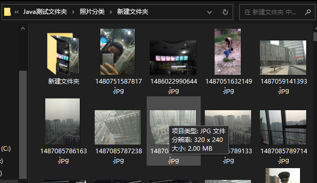

# Java-对文件的增删查改操作

#### 主要实现功能

[1. 创建目录功能](#1. 创建目录)

[2. 对于当前目录下的文件及文件夹以及文件夹下的文件的复制功能](#2-文件的复制)

[3. 对于当前目录下的文件及文件夹以及文件夹下的文件的删除功能](#3-文件的删除)

[4. 对于当前目录下的文件及文件夹以及文件夹下的文件的移动功能](#4-文件的移动)

[5. 对于两个不同目录下文件夹内的文件的去重合并功能](#5-文件的去重合并)

+ 将 srcFileStr 文件夹下的文件 合并到 destFileAllStr 文件夹下 实现清空 srcFileStr 文件夹内所有的文件的功能 
    + 若 srcFileStr 文件夹内的文件与 destFileAllStr 文件夹中文件有重名的情况 则比对它们的大小

      + 5.1.1 若 srcFileStr 文件夹中 文件 比 destFileAllStr 文件夹中的同名文件 占用内存大 
    
        + 5.1.1.1 则将 destFileAllStr 文件夹中占用内存较小的同名文件 存放在 程序自创的 以 destFileAllStr 为参照兄弟级文件夹 同名文件质量较小 中 
     5.1.1.2 将 srcFileStr 文件夹中 同名文件 占用内存较大的文件 存放在 destFileAllStr 文件中
    
    
      + 5.1.2 若 srcFileStr 文件夹中 文件 比 destFileAllStr 文件夹中的同名文件 占用内存小 
        + 5.1.2.1 将 srcFileStr 文件夹中 同名文件 占用内存较小的文件 存放在 程序自创的 以 destFileAllStr 为参照兄弟级文件夹 同名文件质量较小 中 


      + 5.1.3 若 srcFileStr 文件夹中 文件 与 destFileAllStr 文件夹中的同名文件 占用内存相同
        + 5.1.3.1 将 srcFileStr 文件夹中 同名文件 占用内存较相同的文件 存放在 程序自创的 以 destFileAllStr 为参照兄弟级文件夹 同名文件质量相等 中 

[6. 打印日志功能](#6-生成打印日志)

#### 对应的方法

##### [1. 创建目录](#3-文件的去重合并效果演示) 

> 能过如下代码可创建对应的目录

```Java
new File(System.getProperty("user.dir") + File.separator + "test").mkdir();
```

##### [2. 文件的复制](#1-文件的复制效果演示)

```Java
	/**
	 * <p>Title: copyDir</p>  
	 * <p>
	 *    Description: 
	 * </p>  
	 * <p>Copyright: Copyright (c) 2017</p>  
	 * <p>Company: www.baidudu.com</p>  
	 * @param oldPath
	 * @param newPath
	 * @throws IOException  
	 * @author xianxian
	 * @date 2023年1月24日  
	 * @version 1.0
	 */
	private static void copyDir(String oldPath, String newPath) throws IOException {
        File oldFile = new File(oldPath);
        //文件名称列表
        String[] oldFilePath = oldFile.list();
        
        if (!(new File(newPath)).exists()) {
            (new File(newPath)).mkdir();
        }
        
        for (int i = 0; i < oldFilePath.length; i++) {
            if ((new File(oldPath + oldFile.separator + oldFilePath[i])).isDirectory()) {
            	System.out.println(new File(oldPath + oldFile.separator + oldFilePath[i]) + " 是个文件夹 需要重新调用一下方法");
            	info(new File(oldPath + oldFile.separator + oldFilePath[i]) + " 是个文件夹 需要重新调用一下方法", 
            			newPath + oldFile.separator + "log.log" );
                copyDir(oldPath  + oldFile.separator  + oldFilePath[i], newPath  + oldFile.separator + oldFilePath[i]);
            }
            
            if (new File(oldPath  + oldFile.separator + oldFilePath[i]).isFile()) {
                copyFile(oldPath + oldFile.separator + oldFilePath[i], newPath + oldFile.separator + oldFilePath[i]);
                System.out.println(oldPath + oldFile.separator + oldFilePath[i]+ "  复制到  " + newPath + oldFile.separator + oldFilePath[i] + " 成功 ");
                info(oldPath + oldFile.separator + oldFilePath[i]+ "  复制到  " + newPath + oldFile.separator + oldFilePath[i] + " 成功 ", 
                		newPath + oldFile.separator + "log.log" );
    			
            }
        }
    }

	/**
	 * <p>Title: copyFile</p>  
	 * <p>
	 *    Description: 
	 * </p>  
	 * <p>Copyright: Copyright (c) 2017</p>  
	 * <p>Company: www.baidudu.com</p>  
	 * @param oldPath
	 * @param newPath
	 * @throws IOException  
	 * @author xianxian
	 * @date 2023年1月24日  
	 * @version 1.0
	 */
	private static void copyFile(String oldPath, String newPath) throws IOException {
		File oldFile = new File(oldPath);
		File newFile = new File(newPath);
		FileInputStream in = new FileInputStream(oldFile);
		FileOutputStream out = new FileOutputStream(newFile);
		byte[] buffer = new byte[2097152];
		while ((in.read(buffer)) != -1) {
			out.write(buffer);
		}
	}
```

##### [3. 文件的删除](#2-文件的删除效果演示)

```Java
	/**
	 * <p>Title: deleteDirectoryLegacyIO</p>  
	 * <p>
	 *    Description: 
	 *    删除文件夹下所有文件及文件夹 
	 * </p>  
	 * <p>Copyright: Copyright (c) 2017</p>  
	 * <p>Company: www.baidudu.com</p>  
	 * @param filePathStr
	 * @param deletSelefPath  是否删除本身文件 ture 删除本身文件夹 false 不删除本身文件夹
	 * @author xianxian
	 * @date 2023年1月25日  
	 * @version 1.0
	 */
	private static void deleteDirectoryLegacyIO(String filePathStr,Boolean deletSelef) {
		if (filePathStr != null || filePathStr.equals("") != true) {
			File file = new File(filePathStr);
			File[] fileList = file.listFiles();// 无法做到list多层文件夹数据
			if (fileList != null) {
				for (File fileItem : fileList) {// 先去递归删除子文件夹及子文件
					deleteDirectoryLegacyIO(fileItem.getAbsolutePath(),true);
				}
			}
			//deletSelefPath 为true 则删除 自身文件夹
			if(deletSelef) {
				if (file.delete()) {// 再删除自己本身的文件夹
					System.out.println("删除成功 : %s%n " + filePathStr);
					info("删除成功 : %s%n " + filePathStr, null);
				} else {
					System.err.println("删除失败 : %s%n " + filePathStr);
				}
			}
		} else {
			System.err.println("file 不为能空");
		}
	}
```

##### [4. 文件的移动](#3-文件的去重合并效果演示)

```Java
	/**
	 * <p>Title: moveFile</p>  
	 * <p>
	 *    Description: 移动文件
	 * </p>  
	 * <p>Copyright: Copyright (c) 2017</p>  
	 * <p>Company: www.baidudu.com</p>  
	 * @param src 
	 * @param dest  
	 * @author xianxian
	 * @date 2023年1月15日  
	 * @version 1.0
	 */
	private static void moveFile(String src, String dest) {
		File targetPart = new File(dest);
		if (!targetPart.exists()) {
			targetPart.mkdirs();//创建此抽象路径名指定的目录。
		}
		// 以src的最后一个"\"取其下标 截取字符从 最后一个 "\" 到结束 得到 src 的文件全名 再将其 拼接到目标文件名中
		dest = dest + File.separator + src.substring(src.lastIndexOf(File.separator) + 1, src.length());
		try {
			Files.move(Paths.get(src), Paths.get(dest),StandardCopyOption.ATOMIC_MOVE);
			System.out.println("成功了");
		} catch (IOException e) {
			System.out.println("失败了，失败信息： " + e.getMessage());
			e.printStackTrace();
		}
	}
```

##### [5. 文件的去重合并](#3-文件的去重合并效果演示)

```Java
	/**
	 * <p>Title: compareFileNameStr</p>  
	 * <p>
	 *    Description: 
	 *    比较 fileNameStr 字符串 是否 包含 partFileNameStr 字符串
	 * </p>
	 * <p>Copyright: Copyright (c) 2017</p>
	 * <p>Company: www.baidudu.com</p>
	 * @param partFileNameStr 字符串
	 * @param fileNameStr 文件名
	 * @param headOrTail 从头或者尾截取 fileNameStr 字符串进行比较 从头传参为 0 尾部 为 -1
	 * @return  
	 * @author xianxian
	 * @date 2023年1月16日
	 * @version 1.0
	 */
	private static Boolean compareFileNameStr(String partFileNameStr,String fileNameStr,int headOrTail) {
		if(fileNameStr.length() > partFileNameStr.length()) {
			if(headOrTail == 0) {//如果为0则从开始截取字符串相比较
				return fileNameStr.substring(0, partFileNameStr.length()).equals(partFileNameStr);
			}else {//否则从尾部截取比较
				return fileNameStr.substring(fileNameStr.length() -  partFileNameStr.length()).equals(partFileNameStr);
			}
		}else {
			return false ;
		}
	}
	/**
	 * <p>Title: concatFiles</p>  
	 * <p>
	 *    Description: 
	 *    实现文件汇总到 destFileAll 文件夹 功能
	 *    例srcFile 文件夹 与 destFileAll 文件夹中 有很多同名文件 该方法将 srcFile 文件夹合并到destFileAll文件夹中
	 *    同名文件 内存较小存放minDestFileAll文件夹
	 *          内存相同存放theSameDestFileAll文件夹
	 *          内存较大的存放destFileAll文件夹
	 *          最终清空srcFile文件夹为目的
	 * </p>  
	 * <p>Copyright: Copyright (c) 2017</p>  
	 * <p>Company: www.baidudu.com</p>  
	 * @param srcFile 需要清空的文件夹 必传参数
	 * @param destFileAll 汇总的文件夹 必传参数
	 * @param minDestFileAll 存放 同名文件质量较小 文件夹 可指定路径 
	 * @param theSameDestFileAll 存放 同名文件质量相等 文件夹 可指定路径 
	 * @param partFileNameStr  需要与文件名比对的字符 不需比对可以不传
	 * @param headOrTail  从头或是尾部比对 只能为"0"或其它字符类型的数字 不需要比对也可不传
	 * @author xianxian
	 * @date 2023年1月25日  
	 * @version 3.0
	 */
	private static void concatFiles(String ...strings) {
		for (int i = 0; i < strings.length; i++) {
			String srcFileStr = strings[0],
					destFileAllStr = strings[1],
					minDestFileAll = strings[2],
					theSameDestFileAll = strings[3],
					partFileNameStr = strings[4],
					headOrTail = strings[5];
			File srcFile = new File(srcFileStr),
					destFileAll = new File(destFileAllStr);
			File[] srcFileArray = srcFile.listFiles(), 
					destFileAllArray = destFileAll.listFiles();
			//如果 minDestFileAll theSameDestFileAll 未专值 则取 destFileAll 的兄弟级目录创建对应的 文件夹 
			if(minDestFileAll == null || minDestFileAll.equals("")) {
				minDestFileAll = destFileAll.getParent() + File.separator + "同名文件质量较小";
			}
			if(theSameDestFileAll == null || theSameDestFileAll.equals("")) {
				theSameDestFileAll = destFileAll.getParent() + File.separator + "同名文件质量相等";
			}
			
			if(!new File(minDestFileAll).exists()) {
				new File(minDestFileAll).mkdirs();
			}
			
			if(!new File(theSameDestFileAll).exists()) {
				new File(theSameDestFileAll).mkdirs();
			}
			
			for (File srcFile_iteam : srcFileArray) {
				// srcFile 文件夹中的 某文件 是否 与 destFileAll 文件夹中 所有文件 有相同的命名 默认没有相当命名即没有重复
				Boolean srcFileIteamTheSameAsAllDestFillIteam = false;
				Boolean compareFileNameStrResult = partFileNameStr == null || partFileNameStr.equals("") ? 
						true : 
							compareFileNameStr(partFileNameStr, srcFile_iteam.getName(), Integer.parseInt(headOrTail));
				if(srcFile_iteam.isFile() && compareFileNameStrResult) {
					// 将 srcFile文件夹中的元素 与 destFileAll文件夹中的每一个元素 相比较
					for (File destFileAll_iteam : destFileAllArray) {// 如果目标文件为空进不了这个循环
						if (destFileAll_iteam.isFile()) {
//							1. 如果 srcFile文件夹中元素 与 与 destFileAll文件夹中的任意一个元素 名字相同 则 比较 它们的大小
							if (srcFile_iteam.getName().equals(destFileAll_iteam.getName())) {
								srcFileIteamTheSameAsAllDestFillIteam = true;// 名字相同了 表示有复复的了 更改为true
								if (srcFile_iteam.length() > destFileAll_iteam.length()) {
									// destFileAll 元素应该先移动至  minDestFileAll 同名文件质量较小 文件夹
									// 如果 srcFile 元素比 destFileAll 元素大 则 将大的元素 移动至 destFileAll 文件夹
									moveFile(destFileAll_iteam.getAbsolutePath(), minDestFileAll);
									moveFile(srcFile_iteam.getAbsolutePath(), destFileAll_iteam.getParent());
									System.out.println(destFileAll.getAbsolutePath() + " 移动至了 " + minDestFileAll + 
											" NO.149 srcFileIteamTheSameAsAllDestFillIteam: 1 ");
									System.out.println(srcFile_iteam.getAbsolutePath() + " 移动至了 " + destFileAll.getAbsolutePath()
											+ " NO.150 srcFileIteamTheSameAsAllDestFillIteam:1 ");
									break;
								} else {
									// 否则将其再进行比较
									if (srcFile_iteam.length() == destFileAll_iteam.length()) {
										// 如果质量相同则将其移动至 theSameDestFileAll 同名文件质量相等 文件夹
										moveFile(srcFile_iteam.getAbsolutePath(), theSameDestFileAll);
										System.err.println(srcFile_iteam.getAbsolutePath() + " 移动至了 " + theSameDestFileAll + 
												" NO.155 srcFileIteamTheSameAsAllDestFillIteam:2 ");
										break;
									} else {
										// 否则将其移动至 minDestFileAll 同名文件质量较小 文件夹
										moveFile(srcFile_iteam.getAbsolutePath(), minDestFileAll);
										System.out.println(srcFile_iteam.getAbsolutePath() + " 移动至了 " + minDestFileAll + 
												" NO.159 srcFileIteamTheSameAsAllDestFillIteam:3 ");
										break;
									}
								}
							}

						}
					}

					if (!srcFileIteamTheSameAsAllDestFillIteam) {// 无重复时 将 srcFile_iteam 直接 存入到 destFileAll 文件夹
						moveFile(srcFile_iteam.getAbsolutePath(), destFileAll.getAbsolutePath());
						System.out.println(srcFile_iteam.getAbsolutePath() + " 移动至了 " + destFileAll.getAbsolutePath() + 
								" NO.163 srcFileIteamTheSameAsAllDestFillIteam:4 ");
					}
				}
			}
		}
	}
```

##### [6. 生成打印日志](#6-生成打印日志)

```Java
	/**
	 * <p>Title: info</p>  
	 * <p>
	 *    Description: 
	 * 		定义记录日志的方法
	 * </p>  
	 * <p>Copyright: Copyright (c) 2017</p>  
	 * <p>Company: www.baidudu.com</p>  
	 * @param msg
	 * @param pathStr  
	 * @author xianxian
	 * @date 2023年1月25日  
	 * @version 1.0
	 * @throws IOException 
	 */
	private static void info(String msg,String pathStr){
		if (pathStr == null || pathStr.equals("") == true) {
			pathStr = System.getProperty("user.dir") + File.separator + "log.log";
		}
		File file = new File(pathStr);
		if (!file.exists()) {
			try {
				file.createNewFile();
			} catch (IOException e) {
				System.out.println(e.getMessage() + "error wuwuw ");
				e.printStackTrace();
			}
		}
		try {
			// 参数true 表示是否在原文件内容后追加 若不写或写false 则覆盖原文 
			BufferedWriter bufferedWriter = new BufferedWriter(new FileWriter(pathStr,true));
			// 日期当前时间
			Date time = new Date();
			// 格式化日期
			SimpleDateFormat sdfTime = new SimpleDateFormat("yyyy-MM-dd HH:mm:ss");
			// 转换格式
			String strTime = sdfTime.format(time);
			// 内容输出到指定文件中
			bufferedWriter.append(msg + " " + strTime);
			bufferedWriter.newLine();
			
			bufferedWriter.flush();
			bufferedWriter.close();
		} catch (IOException e) {
			e.printStackTrace();
		}
	}
```

#### 测试效果

##### 1. 文件的复制效果演示

```Java
	public static void main(String[] args) {
		try {
			copyDir("G:\\需要复制的文件\\Java测试文件夹\\照片分类\\148开头文件", "G:\\需要复制的文件\\Java测试文件夹\\照片分类\\新建文件夹");//复制文件
		} catch (IOException e) {
			e.printStackTrace();
		}
	}
```





##### 2. 文件的删除效果演示

```Java
	public static void main(String[] args) {
		deleteDirectoryLegacyIO("G:\\需要复制的文件\\Java测试文件夹\\照片分类\\新建文件夹",false);
	}
```


##### 3. 文件的去重合并效果演示

```Java
	public static void main(String[] args) {
		concatFiles("G:\\需要复制的文件\\Java测试文件夹\\照片分类\\148开头文件","G:\\需要复制的文件\\Java测试文件夹\\测试合并文件",null,null,null,null);
	}
```


##### 4. 自动生成日志效果演示

> 前面几个方法的调用都用到了日志生成


#### 项目源码地址

[Gitee项目地址](https://gitee.com/JavaObjects/file-crud)

[Github项目地址](https://github.com/javaobjects/FileCrud)

**以上就是我关于 *Java-对文件的增删查改操作*  知识点的整理与总结的全部内容，希望对你有帮助。。。。。。。**

***
#### 分割线
***

#### 扩展知识

***

分割线

***

**博主为咯学编程：父母不同意学编程，现已断绝关系;恋人不同意学编程，现已分手;亲戚不同意学编程，现已断绝来往;老板不同意学编程,现已失业三十年。。。。。。如果此博文有帮到你欢迎打赏，金额不限。。。**

