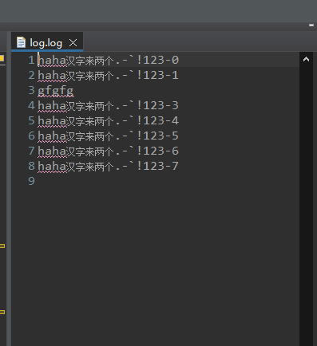
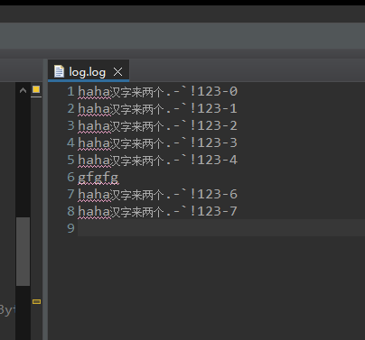
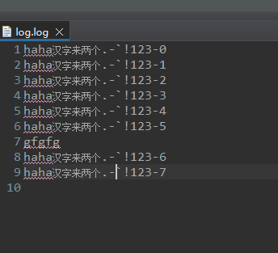
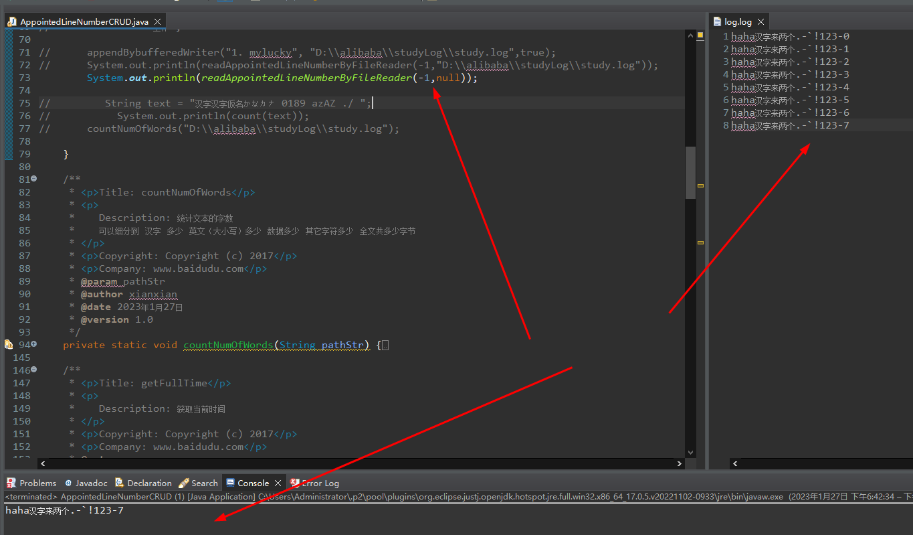
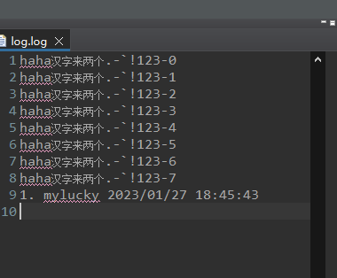
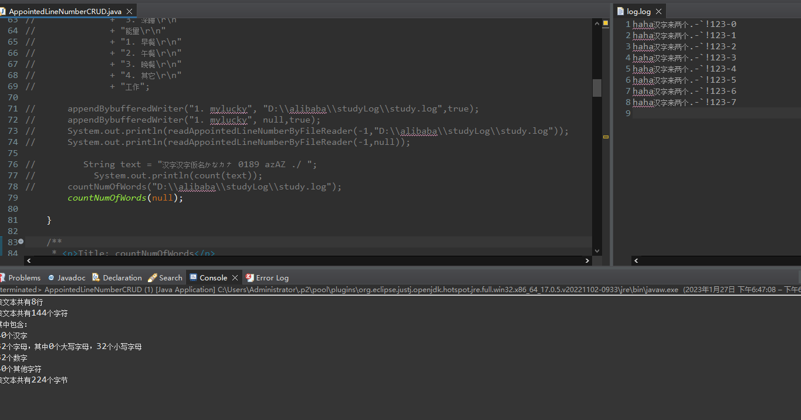

# Java-对文本的增删查改操作.md

#### 主要实现功能

##### [1. 对文本指定行的更改或在指定行后面插入数据功能](#1-对文本指定行的更改或在指定行后面插入数据功能-方法)

> 可以从头更改或插入 也可从尾更改或插入 数据 

##### [2. 读取文本指定行数据功能](#2-读取文本指定行数据功能-方法)

> 实现了可以从头到尾读 也可以从尾到头读 例 传入参数5则读取第五行数据 或传入 -5则读取倒数第五行

##### [3. 在文本尾部添加数据功能](#3-在文本尾部添加数据功能-方法)

##### [4. 统计文本的字数功能](#4-统计文本的字数功能-方法)

> 实现了统计文本所有字数的功能  也可单独取里面的 汉字 的字数 或是 大小写字母 数字 其它字符的字母 也统计了 总的字节数

##### 5. 文本的删除

> 文本的删除由于太过于简单 我懒得写 若你需要这个功能可在 第一个方法中更改关键代码即可

```Java
lines.remove(lineNumber)
```

#### 对应的方法

##### [1. 对文本指定行的更改或在指定行后面插入数据功能-方法](#1-对文本指定行的更改或在指定行后面插入数据功能-测试)

```Java
	/**
	 * <p>Title: setOrAddAppointedLineNumberDataByFiles</p>  
	 * <p>
	 *    Description: 更新指定行数据 或 在指定行数据后面添加数据
	 * </p>  
	 * <p>Copyright: Copyright (c) 2017</p>  
	 * <p>Company: www.baidudu.com</p>  
	 * @param lineNumber
	 * @param data
	 * @param setOrAdd   传值set 则为 更改指定行数据 传add 则在指定行后面添加数据
	 * @param pathStr
	 * @throws Exception  
	 * @author xianxian
	 * @date 2023年1月27日  
	 * @version 1.0
	 */
	public static void setOrAddAppointedLineNumberDataByFiles(int lineNumber, String data, String setOrAdd,
			String pathStr) throws Exception {
		if (pathStr == null || pathStr.equals("")) {
			pathStr = System.getProperty("user.dir") + File.separator + "log.log";
		}
		Path path = Paths.get(pathStr);
		List<String> lines = Files.readAllLines(path, StandardCharsets.UTF_8);
		
		
		if (Math.abs(lineNumber) > lines.size()) {
			throw new Exception("指定行【" + lineNumber + "】不在文件行数范围内");
		}
		if (lines.size() < Math.abs(lineNumber)) {
			throw new Exception("指定列 lineNumber： " + lineNumber + "大于文件本身的行数： " + lines.size());
		} else {
			if (setOrAdd == null || setOrAdd.equals("")) {
				throw new Exception("请传入正确的 setOrAdd 值");
			} else {
				if (setOrAdd.equals("set") || setOrAdd.equals("add")) {
					if (setOrAdd.equals("set")) {
						lines.set(lineNumber < 0 ? lines.size() + lineNumber : lineNumber - 1,data);
					} else {
						lines.add(lineNumber < 0 ? lines.size() + lineNumber + 1 : lineNumber,data);
					}
					Files.write(path, lines, StandardCharsets.UTF_8);
				} else {
					throw new Exception("请传入正确的 setOrAdd 值");
				}
			}
		}
	}
```

##### [2. 读取文本指定行数据功能-方法](#2-读取文本指定行数据功能-测试)

```Java

	/**
	 * <p>Title: readAppointedLineNumberByFileReader</p>  
	 * <p>
	 *    Description: 1.根据指定行读数据 -N 为 倒数第N行
	 * </p>  
	 * <p>Copyright: Copyright (c) 2017</p>  
	 * <p>Company: www.baidudu.com</p>  
	 * @param lineNumber
	 * @param pathStr
	 * @return  
	 * @author xianxian
	 * @date 2023年1月27日  
	 * @version 1.0
	 */
	public static String readAppointedLineNumberByFileReader(int lineNumber, String pathStr) {
		String appointedLine = "";
		FileReader in = null;
		LineNumberReader reader = null;

		if (pathStr == null || pathStr.equals("")) {
			pathStr = System.getProperty("user.dir") + File.separator + "log.log";
		}
		try {
			in = new FileReader(pathStr);
			reader = new LineNumberReader(in);
			long totalLine = Files.lines(Paths.get(pathStr)).count();
			if (Math.abs(lineNumber) > totalLine) {
				throw new Exception("指定行【" + lineNumber + "】不在文件行数范围内");
			}

			int line = 1;
			reader.setLineNumber((int) (lineNumber < 0 ? totalLine + lineNumber + 1 : lineNumber));
			long i = reader.getLineNumber();
			String s = "";

			while ((s = reader.readLine()) != null) {
				if (i == line) {
					appointedLine = s;
					break;
				}
				line++;
			}
			return appointedLine;
		} catch (FileNotFoundException e) {
			e.printStackTrace();
		} catch (IOException e) {
			e.printStackTrace();
		} catch (Exception e) {
			e.printStackTrace();
		} finally {
			closeResource(in, reader);
		}
		return appointedLine;
	}

	/**
	 * <p>Title: closeResource</p>  
	 * <p>
	 *    Description: 2.关闭资源
	 * </p>  
	 * <p>Copyright: Copyright (c) 2017</p>  
	 * <p>Company: www.baidudu.com</p>  
	 * @param in
	 * @param reader  
	 * @author xianxian
	 * @date 2023年1月27日  
	 * @version 1.0
	 */
	public static void closeResource(FileReader in, LineNumberReader reader) {
		try {
			if (reader != null) {
				reader.close();
			}
			if (in != null) {
				in.close();
			}
		} catch (IOException e) {
			e.printStackTrace();
		}
	}
```

##### [3. 在文本尾部添加数据功能-方法](#3-在文本尾部添加数据功能-测试)

```Java
	/**
	 * <p>Title: appendBybufferedWriter</p>  
	 * <p>
	 *    Description: 
	 * </p>  
	 * <p>Copyright: Copyright (c) 2017</p>  
	 * <p>Company: www.baidudu.com</p>  
	 * @param msg
	 * @param pathStr
	 * @param onOffTime  
	 * @author xianxian
	 * @date 2023年1月27日  
	 * @version 1.0
	 */
	private static void appendBybufferedWriter(String msg, String pathStr, Boolean onOffTime) {
		if (pathStr == null || pathStr.equals("")) {
			pathStr = System.getProperty("user.dir") + File.separator + "log.log";
		}
		File file = new File(pathStr);
		if (!file.exists()) {
			try {
				file.createNewFile();
			} catch (IOException e) {
				e.printStackTrace();
			}
		}
		try {
			// 参数true 表示是否在原文件内容后追加 若不写或写false 则覆盖原文
			BufferedWriter bufferedWriter = new BufferedWriter(new FileWriter(pathStr, true));
			// 内容输出到指定文件中
			if (onOffTime == null || onOffTime == false) {
				bufferedWriter.append(msg + " ");
			} else {
				bufferedWriter.append(msg + " " + getFullTime());
			}
			bufferedWriter.newLine();
			bufferedWriter.flush();
			bufferedWriter.close();

		} catch (IOException e) {
			e.printStackTrace();
		}
	}
```

##### [4. 统计文本的字数功能-方法](#4-统计文本的字数功能-测试)

```Java
	/**
	 * <p>Title: countNumOfWords</p>  
	 * <p>
	 *    Description: 统计文本的字数 
	 *    可以细分到 汉字 多少 英文（大小写）多少 数据多少 其它字符多少 全文共多少字节
	 * </p>  
	 * <p>Copyright: Copyright (c) 2017</p>  
	 * <p>Company: www.baidudu.com</p>  
	 * @param pathStr  
	 * @author xianxian
	 * @date 2023年1月27日  
	 * @version 1.0
	 */
	private static void countNumOfWords(String pathStr) {
		try {// try代码块，当发生异常时会转到catch代码块中
				// 读取指定的文件
			if (pathStr == null || pathStr.equals("")) {
				pathStr = System.getProperty("user.dir") + File.separator + "log.log";
			}
			// 创建类进行文件的读取，并指定编码格式为utf-8
			InputStreamReader read = new InputStreamReader(new FileInputStream(pathStr), "utf-8");
			BufferedReader in = new BufferedReader(read);// 可用于读取指定文件

			String linDatastr = null;// 定义一个字符串类型变量linDatastr 用于存放一行的文本数据
			String wordStr = null;// 定义一个字符串类型变量wordStr
			int lineCount = 0, // 定义一个整型变量,用于统计行数
					countWords = 0, // 定义整型变量，用于统计字符数
					chineseWords = 0, upperWords = 0, lowerWords = 0, numberWords = 0, otherWords = 0,
					allEnglishWords = 0, countBytes = 0;// 定义一个整型变量，用于统计字节数
			while ((linDatastr = in.readLine()) != null) {// readLine()方法, 用于读取一行,只要读取内容不为空就一直执行
				lineCount++;// 每循环一次就进行一次自增，用于统计文本行数
				countWords += linDatastr.length();// 用于统计总字符数
				byte[] bytes = linDatastr.getBytes();// 求出该行的字节数组
				countBytes += bytes.length;// 用于统计总字节数
				for (int j = 0; j < linDatastr.length(); j++) {// for循环的条件，当j小于该行长度时就一直循环并自增
					wordStr = Character.toString(linDatastr.charAt(j));// 返回一个字符串对象
					if (wordStr.matches("[\\u4e00-\\u9fa5]")) {// if语句的条件，判断是否为汉字
						chineseWords++;// 若为汉字则c1自增
					} else if (wordStr.matches("[A-Z]")) {// if语句的条件，判断是否为大写字母
						upperWords++;// 若为大写字母则c2自增
					} else if (wordStr.matches("[a-z]")) {// if语句的条件，判断是否为小写字母
						lowerWords++;// 若为小写字母则c3自增
					} else if (wordStr.matches("[0-9]")) {// if语句的条件，判断是否为数字
						numberWords++;// 若为数字则c4自增
					} else {// 否则可判断为其他字符
						otherWords++;// 若为其他字符则c5自增
					}
				}
			}
			allEnglishWords = upperWords + lowerWords;// 统计总的字母数
			in.close();// 关闭流
			System.out.println("该文本共有" + lineCount + "行");// 输出总的行数
			System.out.println("该文本共有" + countWords + "个字符");// 输出总的字符数
			System.out.println("其中包含：");// 输出提示信息
			System.out.println(chineseWords + "个汉字");// 输出汉字数
			System.out.println(allEnglishWords + "个字母，其中" + upperWords + "个大写字母，" + lowerWords + "个小写字母");// 输出字母数
			System.out.println(numberWords + "个数字");// 输出数字数
			System.out.println(otherWords + "个其他字符");// 输出其它字符数
			System.out.println("该文本共有" + countBytes + "个字节");// 输出总的字节数

		} catch (IOException e) {// 当try代码块有异常时转到catch代码块
			e.printStackTrace();// printStackTrace()方法是打印异常信息在程序中出错的位置及原因
		}
	}
```

#### 测试效果

##### [1. 对文本指定行的更改或在指定行后面插入数据功能-测试](#1-对文本指定行的更改或在指定行后面插入数据功能)

```Java
		try {
			setOrAddAppointedLineNumberDataByFiles(3, "gfgfg", "set", null);
		} catch (Exception e) {
			e.printStackTrace();
		}
```


```Java
		try {
			setOrAddAppointedLineNumberDataByFiles(-3, "gfgfg", "set", null);
		} catch (Exception e) {
			e.printStackTrace();
		}
```



```Java
		try {
			setOrAddAppointedLineNumberDataByFiles(-3, "gfgfg", "add", null);
		} catch (Exception e) {
			e.printStackTrace();
		}
```



##### [2. 读取文本指定行数据功能-测试](#2-读取文本指定行数据功能)

```Java
		System.out.println(readAppointedLineNumberByFileReader(-1,null));
```


##### [3. 在文本尾部添加数据功能-测试](#3-在文件指定行添加数据功能)

```Java
appendBybufferedWriter("1. mylucky", null,true);
```


##### [4. 统计文本的字数功能-测试](#4-统计文本的字数功能)

```Java
countNumOfWords(null);
```


**以上就是我关于 *Java-对文本的增删查改操作*  知识点的整理与总结的全部内容，希望对你有帮助。。。。。。。**

***
#### 分割线
***

#### 扩展知识

***

分割线

***

**博主为咯学编程：父母不同意学编程，现已断绝关系;恋人不同意学编程，现已分手;亲戚不同意学编程，现已断绝来往;老板不同意学编程,现已失业三十年。。。。。。如果此博文有帮到你欢迎打赏，金额不限。。。**

